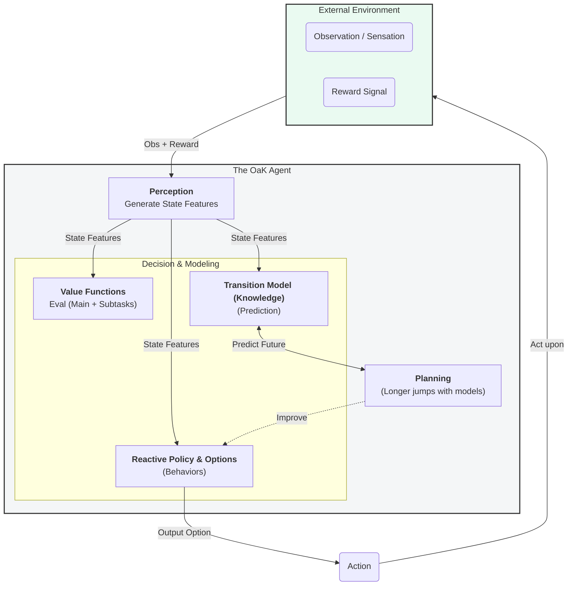
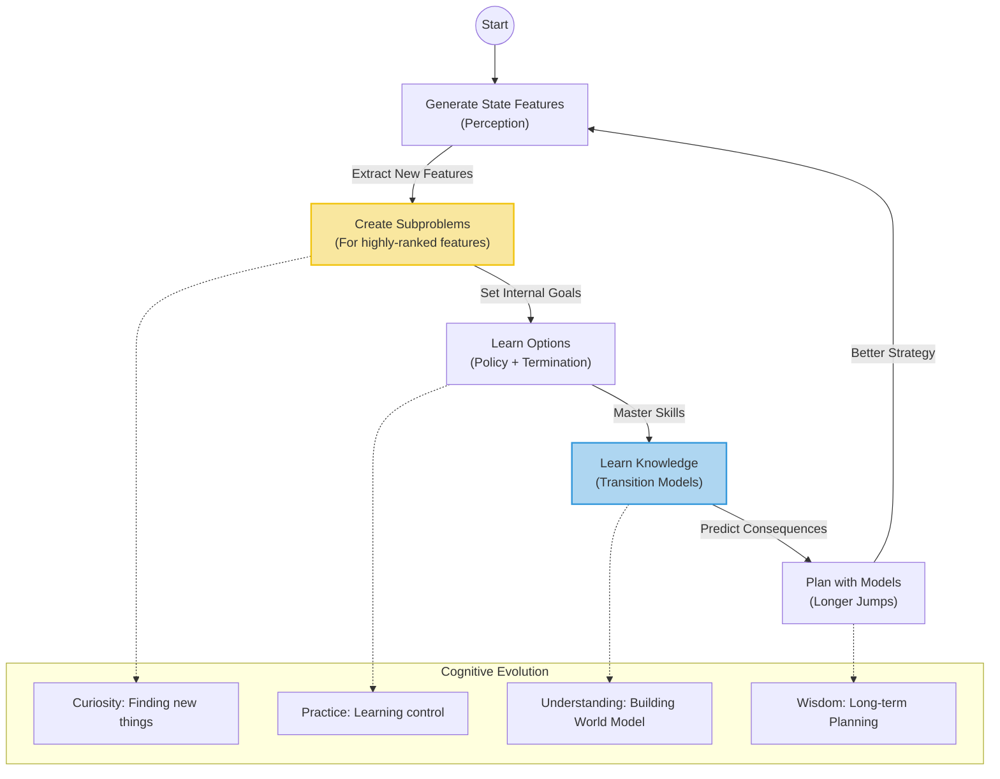

# Deep Dive: OaK Architecture & The Era of Experience


- **Speaker**: Richard Sutton (Father of Reinforcement Learning)
- **Core Theme**: Next-Gen Agent Architecture: OaK (Options and Knowledge)
- **Key Quote**: _"What we want is a machine that can learn from experience."_ — Alan Turing

---

## 1. The Paradigm Shift: Why LLMs Are Not Enough

Sutton argues that we are transitioning between major eras of AI development. To understand why we need a new architecture, we must look at the timeline.


_The evolution from simulation to static data, and finally to interactive experience._


```mermaid

graph LR
    <!-- %% Styles
    classDef past fill:#e0e0e0,stroke:#333,stroke-width:1px;
    classDef present fill:#ffebd0,stroke:#f39c12,stroke-width:2px;
    classDef future fill:#d5f5e3,stroke:#27ae60,stroke-width:4px; -->

    %% Era 1
    subgraph Era1 ["2014 - 2018"]
        direction TB
        A["<b>Era of Simulation</b><br/>(Simulated Env)"]
        A1("Atari Games")
        A2("AlphaGo / AlphaZero")
        A --> A1
        A --> A2
    end

    %% Era 2
    subgraph Era2 ["2018 - 2023"]
        direction TB
        B["<b>Era of Human Data</b><br/>(Static Datasets)"]
        B1("GPT-3 / GPT-4")
        B2("ChatGPT / Claude")
        B --> B1
        B --> B2
        note1["Limitation: Imitation<br/>Lack of Interaction"]
    end

    %% Era 3
    subgraph Era3 ["2024 Onwards"]
        direction TB
        C["<b>Era of Experience</b><br/>(First-person Interaction)"]
        C1("AlphaProof")
        C2("OaK Architecture")
        C --> C1
        C --> C2
        note2["Goal: Superhuman<br/>Self-generated Data"]
    end

    %% Connections
    Era1 -.-> Era2
    Era2 ==>|Paradigm Shift| Era3

    %% Apply Styles
    class A,A1,A2 past;
    class B,B1,B2,note1 present;
    class C,C1,C2,note2 future;
```

### Key Analysis of the Eras

- **Era of Human Data (Status Quo)**:
    - **Source**: Static, historical human text/code.
    - **Limitation**: Intelligence is capped by the quality of human data. It is essentially "Imitation Learning."
- **Era of Experience (The Future)**:
    - **Source**: **First-person Experience** (Sensation + Action + Reward).
    - **Advantage**: Like AlphaGo's "Move 37," RL can discover strategies humans have never found through trial-and-error.

## 2. Core Architecture: OaK (Options and Knowledge)

To adapt to this "Era of Experience," Sutton proposes the **OaK Architecture**. This is not just a policy network, but a complete cognitive system.


_How the internal components connect to build a "Mind"._



### Component Definitions

1. **O - Options (Skills)**:
    - The unit of behavior is not an atomic `Action`, but a **temporally extended skill**.
    - _Definition_: A pair $(\pi, \gamma)$.
    - _Example_: "Open the door" (Sequence of moves) vs. "Move hand 1cm" (Atomic).
2. **K - Knowledge (World Model)**:
    - Specifically refers to the **Transition Model**.
    - _Function_: It predicts, "If I execute this Option, where will I end up?"


## 3. Runtime Mechanism: The Dynamic Loop

OaK is not a static script. It is a process performed in parallel at runtime to essentially "grow" a mind.


_The cycle of curiosity and mastery._



### How it works:

1. **Feature Generation**: The agent notices a new feature (e.g., "The door is open").
2. **Subproblem Creation** (Curiosity): It asks, "How can I make the door open?"
3. **Learn Options** (Skill): It practices until it masters opening the door.
4. **Learn Knowledge** (Understanding): It learns that "Opening the door leads to the hallway."
5. **Planning**: Now it can plan: "Open door -> Go to Hallway," jumping over the micro-steps.

## 4. Comparison: Standard RL vs. OaK

Why is OaK better for AGI?

|**Feature**|**Standard RL Agent**|**OaK Agent (Sutton's Vision)**|
|---|---|---|
|**Goal**|Single Main Goal|**Multiple Goals** (Main + Countless Subproblems)|
|**Unit of Behavior**|Atomic Action|**Option / Skill**|
|**World Model**|Pixel-level / Next-step|**State-to-State / Consequence Prediction**|
|**Driver**|Extrinsic Reward|**Curiosity & Feature Attainment**|
|**Planning**|Short-sighted or expensive|**Long-jump Planning** (Temporal Abstraction)|

---

## 5. Key Takeaways for Review

1. **The Route to AGI**: Sutton argues LLMs are great interfaces to knowledge, but **RL is the core of intelligence**because only RL breaks the data ceiling through interaction.
2. **Revival of Hierarchical RL (HRL)**: OaK is essentially the ultimate form of HRL—**Automatic** sub-goal discovery, **Automatic** skill learning, and **Automatic** high-level modeling.
3. **The Nature of Planning**: In OaK, planning happens at the "Concept/Skill" level, not the "Pixel" level. This mirrors human reasoning (e.g., "Drive to airport" vs. "Move foot 1cm forward").